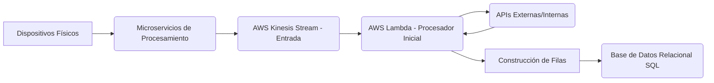
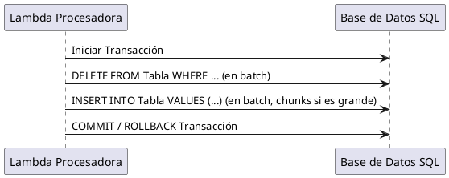
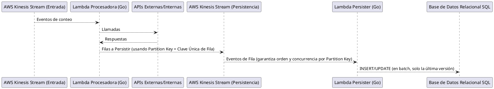

## Desenredando la Maraña: Optimizando un Flujo de Procesamiento de Datos de Alto Volumen

En el desarrollo de sistemas distribuidos, las complejidades a menudo se manifiestan en producción de maneras inesperadas. Recientemente, nos enfrentamos a un desafío significativo en nuestra plataforma: un sistema diseñado para procesar conteos de dispositivos físicos exhibía una latencia inaceptable, múltiples timeouts y, lo que era más crítico, una serie recurrente de deadlocks en la base de datos. Este post detalla el problema, nuestros enfoques iniciales y la solución final que nos permitió escalar eficientemente.

### El Escenario Original: Un Flujo de Datos Crítico

Nuestro sistema se encarga de leer conteos de dispositivos físicos. Estos datos son procesados a través de varios microservicios antes de ser enviados a un **stream de AWS Kinesis**. Posteriormente, una **AWS Lambda** consume estos eventos de Kinesis, realiza llamadas a diversas APIs internas y externas, construye filas estructuradas y finalmente las persiste en una **base de datos relacional SQL**.

*Diagrama 1: Flujo de Datos Original*

### Los Síntomas de la Alarma en Producción

Los problemas que comenzamos a observar eran claros y perjudiciales:

1.  **Latencia Excesiva:** Datos que tardaban horas en ser procesados, comprometiendo la frescura de la información.
2.  **Timeouts Constantes:** La Lambda procesadora, con un límite de ejecución de 30 segundos, frecuentemente excedía este umbral durante las llamadas a APIs, la construcción de filas o las operaciones de base de datos.
3.  **Deadlocks Recurrentes:** Este era el síntoma más preocupante, indicando una contención severa en la base de datos que paralizaba el procesamiento.

### Desentrañando el Principal Culpable: Los Deadlocks

Decidimos abordar los deadlocks como prioridad máxima, ya que su resolución impactaría directamente en la estabilidad y la latencia general del sistema.

#### La Raíz del Problema: Operaciones Concurrentes en la Base de Datos

Nuestra estrategia original para guardar, eliminar o actualizar filas en la base de datos se centraba en transacciones. La lógica era, en esencia, la siguiente:

  * **Enfoque Pre-existente:**
    1.  Abrir una transacción.
    2.  Seleccionar las filas involucradas.
    3.  Si una fila existe, actualizarla; de lo contrario, insertarla.
    4.  Para eliminaciones, una lógica similar.

Esta operación se realizaba a veces de forma individual (fila por fila) y otras veces en lotes (`bulk`). Ambas variantes generaban un alto número de "round trips" a la base de datos, consumiendo tiempo y recursos.

#### Primer Intento de Solución: Simplificación y Batching

Nuestra primera hipótesis fue que la complejidad de la lógica de "seleccionar y luego insertar/actualizar" contribuía a los deadlocks. Propusimos una operación más simple y eficiente:

  * **Estrategia:**
    1.  Eliminar todas las filas relacionadas (si existen o no, eliminarlas de forma condicional).
    2.  Insertar todas las nuevas filas en un solo lote (`batch`).
    3.  Todo dentro de una única transacción.
    4.  Si el lote era muy grande, dividirlo en "chunks" más pequeños.

<!-- end list -->

*Diagrama 2: Primer Intento de Optimización en BD*

  * **Resultado:** Aunque la lógica parecía más limpia, los deadlocks y timeouts persistían. Las transacciones no cerradas debido a los timeouts dejaban bloqueos activos, creando un **efecto dominó** de procesos en espera y nuevos timeouts.

#### Segundo Intento: Eliminando Transacciones Explícitas y Utilizando `MERGE`

Ante la persistencia del problema, consideramos que la gestión explícita de transacciones y los múltiples `round trips` seguían siendo la causa.

  * **Estrategia:**

    1.  Eliminar las transacciones explícitas.
    2.  Aprovechar funcionalidades del motor de base de datos como `ON CONFLICT` (si disponible) o `MERGE` (como en nuestro caso) para realizar operaciones de "insertar o actualizar" en una sola consulta. Esto reduce la necesidad de múltiples `SELECT` antes de `INSERT/UPDATE`.
    3.  Mantener el procesamiento en pequeños lotes (`chunks`).

  * **Resultado:** Hubo una **disminución notable en la frecuencia de deadlocks y timeouts**, lo que indicaba que estábamos en el camino correcto. Sin embargo, no se eliminaron por completo. Cada consulta `MERGE` seguía implicando una transacción interna a nivel de motor de base de datos, y la concurrencia en las mismas filas aún podía generar contención, aunque menos frecuente.

#### La Solución Definitiva: Desacoplamiento y Serialización con Kinesis Partition Keys

Fue en este punto donde realizamos un `brainstorming` y concebimos una solución radicalmente diferente, inspirada en patrones de sistemas distribuidos y aprovechando las capacidades de AWS Kinesis.

La idea central era **garantizar que las operaciones sobre una misma entidad (fila de base de datos con una clave única) nunca se procesaran concurrentemente**. Para lograr esto, rediseñamos el flujo:

1.  **Separación de Responsabilidades:**

      * La **Lambda original (Procesadora)** se encargaría únicamente de consumir el Kinesis de entrada, invocar APIs y **generar las filas de datos finales**.
      * Estas filas generadas no se insertarían directamente en la base de datos, sino que se enviarían a un **segundo stream de Kinesis**.

2.  **El "Persister" y Kinesis Partition Keys:**

      * Una **nueva Lambda (Persister)** sería la única responsable de consumir del segundo Kinesis y **persistir los datos en la base de datos**.
      * **Crucialmente, al enviar las filas al segundo Kinesis, utilizamos la clave única de cada fila como `Partition Key` del evento de Kinesis.** Kinesis garantiza que todos los eventos con la misma `Partition Key` son entregados a la misma "shard" y, por lo tanto, procesados por la misma instancia de la Lambda Persister, y en el orden en que fueron recibidos.

<!-- end list -->

*Diagrama 3: Arquitectura Optimizada con Doble Kinesis y Partition Keys*

Este enfoque nos permitió:

  * **Eliminar Contención:** Al serializar las operaciones por `Partition Key`, dos instancias de la Lambda Persister nunca intentarían modificar la misma fila en la base de datos al mismo tiempo. ¡**Adiós a los deadlocks**\!

  * **Optimización de Batching:** La Lambda Persister podía procesar lotes más grandes. Si dentro de un batch recibía múltiples eventos para la misma `Partition Key` (es decir, la misma fila se actualizó varias veces), simplemente tomaba la **versión más reciente**, reduciendo la cantidad efectiva de operaciones de `INSERT/UPDATE` en la base de datos.

  * **Mayor Paralelismo:** Descubrimos que teníamos una distribución ineficiente de `Partition Keys` en otros lugares, con solo unas pocas claves dominantes. Al usar claves únicas de fila, logramos una distribución mucho más granular, lo que permitió a Kinesis distribuir la carga de manera efectiva entre muchas más shards y, por ende, a nuestra Lambda Persister escalar horizontalmente de manera más eficiente.

  * **Resultado:** ¡Un éxito rotundo\! Los deadlocks desaparecieron por completo. El procesamiento de filas se volvió predecible y rápido. Pudimos aumentar el `batch size` y el factor de paralelización, garantizando el orden por entidad y mejorando drásticamente el rendimiento general del sistema.

### Abordando los Timeouts en las Llamadas a APIs

Una vez resueltos los deadlocks, nos centramos en los recurrentes timeouts provocados por las llamadas a APIs, que seguían siendo un cuello de botella en la primera Lambda procesadora.

#### Estrategias de Optimización para APIs:

1.  **Reducción de la Redundancia (Cacheo en Memoria):** Identificamos patrones donde se realizaban múltiples llamadas idénticas a la misma API dentro del procesamiento de un lote de eventos. Implementamos un mecanismo de cacheo simple en memoria para evitar repetir estas llamadas, lo que resultó en una reducción significativa de solicitudes de red.

    | Antes          | Después        |
    | :------------- | :------------- |
    | 100 llamadas (50 únicas, 50 repetidas) | 50 llamadas (solo las únicas) |
    *Tabla 1: Comparativa de llamadas a API*

2.  **Llamadas en Lote (Batch Endpoints):** Colaboramos con los equipos de las APIs para que expusieran `endpoints` que aceptaran listas de identificadores o parámetros. Esto nos permitió hacer una sola llamada para obtener información de múltiples recursos, en lugar de una llamada individual por cada uno.

3.  **Concurrencia en Go:** Aprovechando la facilidad de Go para manejar la concurrencia (goroutines), modificamos la lógica de llamadas a APIs para ejecutarlas en paralelo en lugar de secuencialmente. Esto redujo el tiempo de espera total, especialmente cuando se dependía de varias APIs.

4.  **Optimización de los Servicios Propietarios de las APIs:** Durante la depuración, descubrimos que los propios servicios que exponían estas APIs también tenían problemas:

      * **Cuellos de botella en conexiones:** Agotamiento de `pools` de conexiones HTTP y de base de datos. Se optimizaron los límites de conexión.
      * **Clientes HTTP ineficientes:** Centralizamos y mejoramos la configuración de nuestros clientes HTTP.
      * **Peticiones mal formadas:** Se corrigieron algunas peticiones HTTP que eran ineficientes o incorrectas.
      * **Visibilidad:** Se mejoró el `logging` para facilitar la identificación de problemas.

<!-- end list -->

  * **Resultado:** Estas optimizaciones combinadas lograron **disminuir considerablemente la ocurrencia de timeouts**. Para los casos residuales donde un servicio de API podría caer temporalmente, confiamos en los mecanismos de **reintentos nativos de Lambda** y una **Dead Letter Queue (DLQ)** para asegurar que los eventos eventualmente se procesaran sin pérdida de datos.

### Conclusiones: De la Crisis a la Escalabilidad

La odisea desde los deadlocks recurrentes y la latencia extrema hasta un sistema estable y escalable fue una lección valiosa en ingeniería de sistemas distribuidos. La clave residió en:

  * **Diagnóstico preciso:** No asumir que el problema está donde el síntoma es más obvio.
  * **Enfoque iterativo:** Intentar soluciones pequeñas y medir su impacto.
  * **Re-arquitectura audaz:** No tener miedo de rediseñar componentes clave cuando las optimizaciones incrementales no son suficientes.
  * **Aprovechar las fortalezas de la plataforma:** El uso estratégico de Kinesis `Partition Keys` fue un game-changer para la serialización de operaciones críticas.

Hoy, nuestro sistema no solo procesa los conteos de dispositivos de manera fiable y en tiempo real, sino que está preparado para escalar a volúmenes de datos mucho mayores, demostrando el poder de la arquitectura pensada y la optimización continua.

---

### Lecciones Aprendidas y Siguientes Pasos

Si bien esta intervención fue un éxito para resolver los problemas críticos de producción, el proceso de diagnóstico e implementación sacó a la luz una serie de desafíos arquitectónicos y culturales más profundos. Estos representan nuestras próximas fronteras para la optimización y la madurez del sistema.

#### 1. Gestión de Particiones en Kinesis y el Problema de los "Hot Shards"

Uno de nuestros descubrimientos clave fue el uso subóptimo de AWS Kinesis en varios servicios. Encontramos sistemas que utilizaban un número muy reducido de `Partition Keys` (a veces incluso una sola clave estática) para volúmenes de datos significativos.

Esto genera "hot shards" (shards que reciben una cantidad desproporcionada de tráfico), anulando por completo los beneficios de paralelismo y escalabilidad que ofrece Kinesis. Un siguiente paso crucial es auditar nuestros flujos de datos y **aplicar una estrategia de particionamiento granular y distribuida** en toda la plataforma, similar a la que implementamos en nuestra solución, para garantizar una distribución de carga equitativa.

#### 2. La Proliferación de Clientes HTTP y la Oportunidad del Circuit Breaker

Notamos una tendencia preocupante: muchos servicios crean nuevas instancias de clientes HTTP de forma indiscriminada para cada llamada. Esta práctica no solo es ineficiente (no reutiliza conexiones), sino que hace que la gestión de la resiliencia sea casi imposible.

La solución a corto plazo fue centralizar el uso de clientes, pero la oportunidad a largo plazo es mayor. Planeamos desarrollar un **cliente HTTP centralizado y "enriquecido"** que incorpore patrones de resiliencia de forma nativa. El más importante de ellos sería el patrón **Circuit Breaker**. Un Circuit Breaker detectaría cuándo un servicio dependiente está fallando (por ejemplo, devolviendo errores 5xx o timeouts) y "abriría el circuito", dejando de enviarle tráfico por un breve período. Esto le daría al servicio caído un tiempo vital para recuperarse, en lugar de ser saturado por reintentos constantes, mejorando la estabilidad de todo el ecosistema.

#### 3. Deuda Técnica y la Necesidad de un Cambio de Mentalidad

Finalmente, este incidente expuso una cantidad considerable de **deuda técnica** acumulada. Más importante aún, reveló una brecha en nuestro enfoque de diseño: muchos componentes no se construyeron pensando en la escala de producción desde el primer día.

La falta de **pruebas de carga exhaustivas** (simulando picos reales de producción) permitió que estos problemas crecieran silenciosamente. El siguiente paso no es solo técnico, sino cultural. Necesitamos fomentar un cambio de mentalidad en el equipo, priorizando la **escalabilidad, la resiliencia y la observabilidad** como requisitos no funcionales de primer nivel, y no como algo que se "arregla" después. Esto implica pensar en pruebas de carga, patrones de resiliencia y distribución de datos desde la concepción de cada nueva funcionalidad.